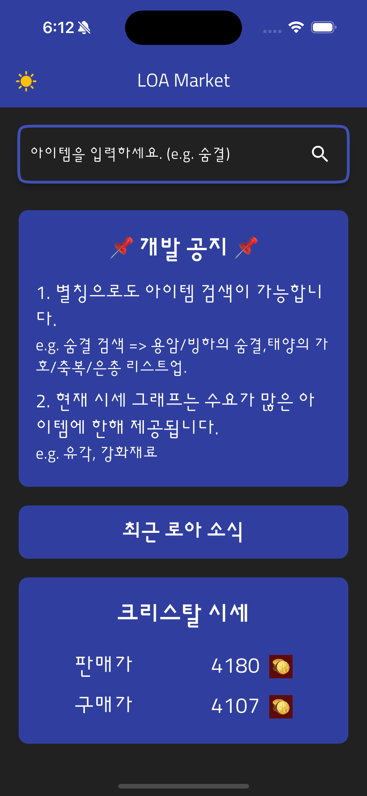
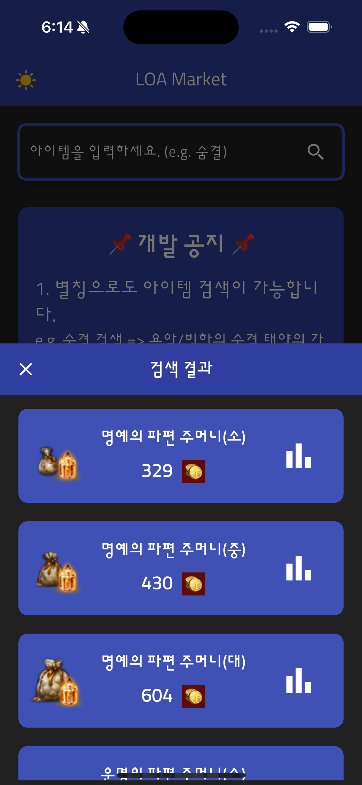
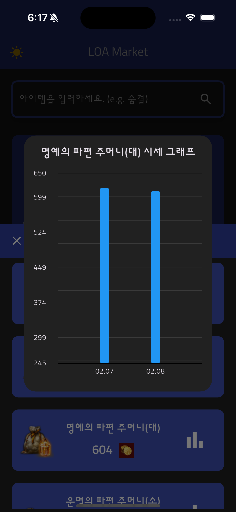

# Loa Market

## Overview

📌 When building the project for the first time, it takes some time due to firebase integration.

### Installation

1. Clone the repository

```bash
git clone https://github.com/augusstt06/loa_market.git
cd loa-market
```

2. Install dependencies

```bash
flutter pub get
```

3. Run the app

```bash
flutter run
```

📌 Test Firebase

```bash
# In root directory
cd functions

# Install dependencies
npm install

# firebase emulator start
firebase emulators:start

# Open firebase functions shell
firebase functions:shell

# Function execution
recordDailyPrices()
```

## Features

An app that allows you to easily check the prices of items from the Lost Ark auction through the app.

First of all, this project plans to give priority to searching for goods needed for character development.

Below are examples of items that meet the conditions:

- **파괴/수호석**
- **명예/운명의 파편**
- **오레하/아비도스 융화재료**
- **에스더의 기운**
- **태양의 은총/축복/가호**
- **용암/빙하의 숨결**
- **유물/전설 각인서**

## Screens

### 1. Home

The first screen displayed when entering the app.



- **Search Widget (검색창)**

  - Search Widget to search for items.
  - When searching, move to a screen that shows items matching the search term.

- **Development Announcement Widget (개발 공지)**

  - Announcements that occur while developing the app.
  - Display briefly in the center of the screen.

- **Notice Widget (공지사항)**

  - Notice from Lost Ark public homepage.
  - Show the 3 most recent notice tabs, moves to the public homepage when clicked.

- **Crystal Price Widget (크리스탈 가격)**
  - Shows the current crystal price.
  - The price is updated through API once an hour.

### 2. Search Result

When searching, a screen that lists items that match the search term.



- **Item List Widget (아이템 목록)**

  - List items that match the search term.
  - **Include the nickname by which users call the item.**
    > e.g "숨결" 검색시 용암/빙하의 숨결 이외, 태양의 축복, 은총, 가호 리스트업.
  - When clicked on item, go to item detail screen.

- **Item Price History Graph Widget (아이템 시세 그래프)**
  - Shows the price history of the item.
  - When clicked, a price graph pop-up for the item opens.
    > Graphs are provided only for high demand items.

### 3. Graph Pop-up

It shows the market price trend for the item.



- **Info Widget (정보)**

  - Currently, there is not much data in the database, so daily price changes are displayed.
  - In the future, we plan to display data at weekly intervals.

## API

This is the API used in the project.

### [Lostark API](https://developer-lostark.game.onstove.com/)

- **POST /markets/items**

Endpoint: https://developer-lostark.game.onstove.com/markets/

```json

{
    "_comment": "parameter",
    "properties": {
        "sort": {
            "type": "string"
        },
        "categoryCode": {
            "type": "integer"
        },
        "itemName": {
            "type": "string"
        },
        "PageNo": {
            "type": "integer"
        },
        "SortCondition": {
            "type": "string"
        }
    },
    "required": ["sort", "categoryCode", "itemName", "PageNo", "SortCondition"]
}

{
    "_comment": "response",
    "properties": {
        "PageNo": {
            "type": "integer"
        },
        "PageSize": {
            "type": "integer"
        },
        "TotalCount": {
            "type": "integer"
        },
        "Items": {
            "type": "array",
            "items": {
                "type": "object",
                "properties": {
                    "Id": {
                        "type": "integer"
                    },
                    "Name": {
                        "type": "string"
                    },
                    "Grade": {
                        "type": "string"
                    },
                    "Icon": {
                        "type": "string"
                    },
                    "BundleCount": {
                        "type": "integer"
                    },
                    "TradeRemainCount": {
                        "type": ["integer", "null"]
                    },
                    "YDayAvgPrice": {
                        "type": "integer"
                    },
                    "RecentPrice": {
                        "type": "integer"
                    },
                    "CurrentMinPrice": {
                        "type": "integer"
                    }
                }
            }
        }
    },
    "required": ["PageNo", "PageSize", "TotalCount", "Items"]
}
```

- **GET /news/notices**

Endpoint: https://developer-lostark.game.onstove.com/news/notices

```json
{
  "_comment": "response",
  "properties": {
    "Title": {
      "type": "string"
    },
    "Date": {
      "type": "string"
    },
    "Link": {
      "type": "string"
    },
    "Type": {
      "type": "string"
    }
  },
  "required": ["Title", "Date", "Link", "Type"]
}
```

### [External API](https://lostarkapi.info/docs#/)

- **GET /crystal/**

Endpoint: https://lostarkapi.info/crystal/

```json
{
  "_comment": "response",
  "properties": {
    "Buy": {
      "type": "string"
    },
    "Sell": {
      "type": "string"
    },
    "Date": {
      "type": "string"
    },
    "Result": {
      "type": "string"
    }
  },
  "required": ["Buy", "Sell", "Date", "Result"]
}
```
